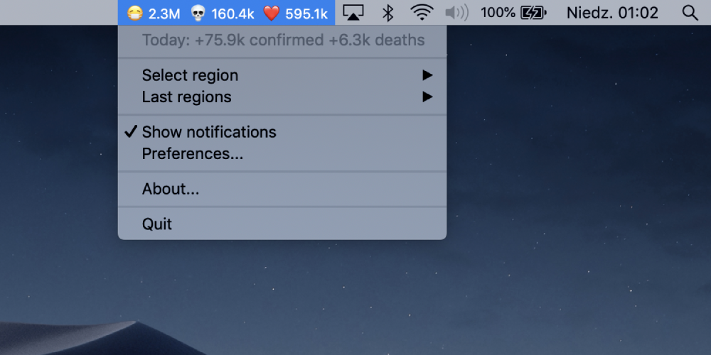
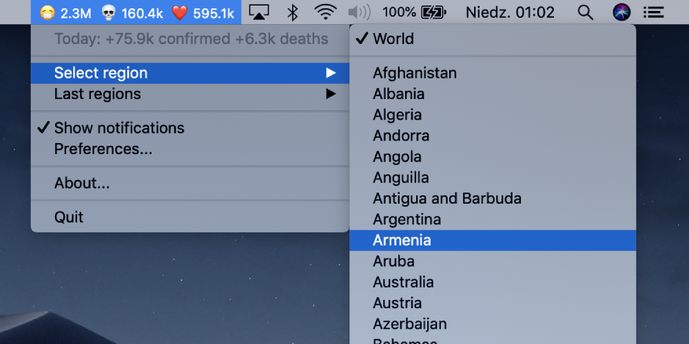

#  COVID-19 Status

A small widget that shows the ongoing COVID-19 pandemic stats in your MacOS computer menu bar

👉 **[Download the app latest version here][DOWNLOAD]**

## Features

* Allow to choose between global and region specific stats
* Shows daily change in chosen statistic
* Displays notifications when followed statistic updates
* Has english and polish localisations

## Data source

The data is fetched from [corona-stats.online REST API](https://corona-stats.online/?source=2) every three minutes.

## Screenshots

## Follow many regions at once

Use those commands in your terminal to open multiple copies of the widget:

    cd ~/Applications # or wherever is the app
    open -n -a "Covid-19 Status"

## Help and contribution

Feel free to send pull requests and to create issues.

## Development

To run this project in Xcode you must first install Carthage dependiences

    brew install carthage
    carthage bootstrap

## License

[MIT licensed](./LICENSE)

[DOWNLOAD]: https://github.com/marcingajda/covid-19-status/releases/download/v1.2.0/Covid-19.Status.v1.2.0.dmg
